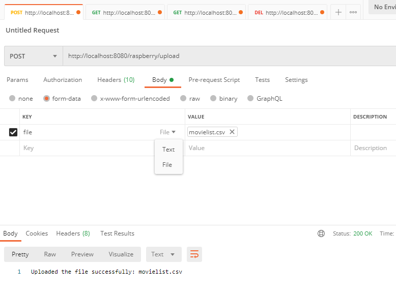
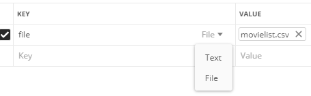

# 📁 Golden raspberry awards

This Spring boot application is responsible for reading a csv file ( with rows separated by ' ; ' character) with films that had won the award for the worst film of the year.

**This application has an endpoint for you to upload the file**, also, you can reset the database by a `DELETE` endpoint without restarting the application.

# 🛠️ How to run

Please follow the instructions to run this application:

* Used Maven 3.9.1 and JDK 19

Maven build:

        mvn clean
        mvn install

To run the integration tests alone, please run:

        mvn verify

Go to the `\golden-raspberry-awards\target` directory and find the `golden-raspberry-awards-0.0.1-SNAPSHOT.jar` file built, then run:

        java -jar .\golden-raspberry-awards-0.0.1-SNAPSHOT.jar

Now, if everithing works, please check the `/about` endpoint at:

        http://localhost:8080/raspberry/about

You may see the following text:
    
        Golden Raspberry Awards Service (Version 1.0) created by Alexandre Hauffe

#  How it works

### Endpoints:

Please use Postman to better execute and test this application, this is also necessary to facilitate uploading documents as the following image shows:

* ### Upload csv file and load the data

        POST:   http://localhost:8080/raspberry/upload

  * #### Request body
    As described in the beginning of this topic, in postman go to body -> format-data -> and add:

    * key: "file"
    * Hover the box and change the format to `file` 
    * value: Select the .csv file you want to read

* ### Get all films

        GET:   http://localhost:8080/raspberry/films

  No request body needed, returns all the films loaded.

* ### Get the min and max values from the winner producer by the years

        GET:  http://localhost:8080/raspberry/winners

  No request body needed, return the minimum and maximum time between years of award by producers

* ### Clean up the database

  This is an extra, to facilitate uploading files without restart the application

        DELETE:  http://localhost:8080/raspberry/clear

* ### H2 URL to access database if needed

        http://localhost:8080/h2-console/

# Final considerations

This was a cool exercise for me to practice some forgotten tools, such as the file upload endpoint. 
I understand that this wasn't required, but I think it's better to have this endpoint to upload the file
instead of restart the application with a new file several times, which is really time-consuming during the development.